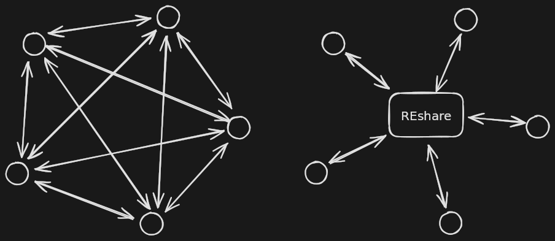

# REshare - A Reverse Engineering Exchange Format

A human- and machine-readable schema to represent knowledge obtained during reverse engineering.Inspired by [Travis Goodspeed - Some Thoughts on Literate Disassembly and Symbol Porting](https://www.youtube.com/watch?v=HyTkqcfSv4w).

With an exchange format we only have to implement a single importer/exporter pair for each tool we want to support to be able to transfer data between all tools. 



Presentations and blog posts:

* r2con'25 - When Worlds Collide - r4ghidra [video](https://www.youtube.com/watch?v=NbSiNBaBgM4&pp=ygUIcjRnaGlkcmHSBwkJTQoBhyohjO8%3D) [slides](https://scrapco.de/dataslate/r2con-r4ghidra.pdf)
* [REshare Ramblings - Bad Vibes with IDA](https://scrapco.de/blog/reshare-ramblings-bad-vibes-with-ida.html)

The repo contains a [JSON Type Definition](https://jsontypedef.com/) that can be automatically converted to serializers/deserializers in multiple languages using `jtd-convert`. 

With serializers we can build source-specific exporters to generate JSON representation of program information from arbitrary sources. We are currently aware of the following exporters:

* [reshare-pdb](https://github.com/v-p-b/reshare-pdb) - Export from PDB
* [reshare-pyghidra](https://github.com/v-p-b/reshare-pyghidra) - Export from Ghidra
* [reshare-ida](https://github.com/v-p-b/reshare-ida) - Export from IDA

With deserializers we can build target-specific importers to provide the information in the REshare JSON representation to arbitrary tools. We are currently aware of the following importers:

* [reshare-pyghidra](https://github.com/v-p-b/reshare-pyghidra) - Import to Ghidra
* [reshare-r2](https://github.com/v-p-b/reshare-r2) - Import to r2
* [reshare-ida](https://github.com/v-p-b/reshare-ida) - Import to IDA

**The type definition is currently highly unstable. Expect breaking changes and always pin exact library versions in your tools!**

## Principles of the data model

* **Embrace redundancy** - Redundant data can be used by importers for error recovery.
* **Flexibility** - Export what you can. Most properties are optional, while extra information can be embedded in the output. (Note: we will enable JTD's `additionalProperties` once the code is somewhat stabilized and we have enough tests)
* **Reasonable abstractions** - We aim to support common architectures and formats. If you need something special, feel free to create a variant!

## Building

Use the provided `Makefile` - we assume `./jtd-codegen` to be present in the current directory, but you can override that:

```
$ make java
$ JTD=/path/to/jtd-codegen make python
```

Currently Python and Java generation are implemented. `make format` formats the JTD definition with `jq`.

### Java

Gradle configuration is provided to build a library from the generated code:

```
java/ $ ./gradlew jar # builds simple Jar 
java/ $ ./gradlew shadowJar # builds fat Jar with dependencies included
```

## Contributing

Please use the `make format` command before sending patches!

JTD generated code should not appear in the repo. 


### Importer/Exporter Structure

Here are some significant points about current import/export algorithms:

* REshare identifies data types by name, as we can expect these to by unique. Having a function to produce target type objects by name and one from source objects is useful. (In case of import, source objects come from REshare, target object are tool specific, like `tinfo_t` or `DataType`. Vice versa in case of export)
* Using recursion for traversing the data type graph is an obvious solution and I stuck with that. Debugging infinite recursion is not fun though.
* Since types can reference each other we first fill an in-memory hash table with target-specific objects. When all is done we use this complete view of data types to populate the tool database or the REshare export. This way we can reference all referenced types when needed and probably gain some performance too.
* Because of circular references, we may need to insert to our map incomplete types first, the complete them later - this requires target objects to be mutable. 

You are not required to follow these, but may help understanding existing code and some of the tricky cases it aims to solve.

